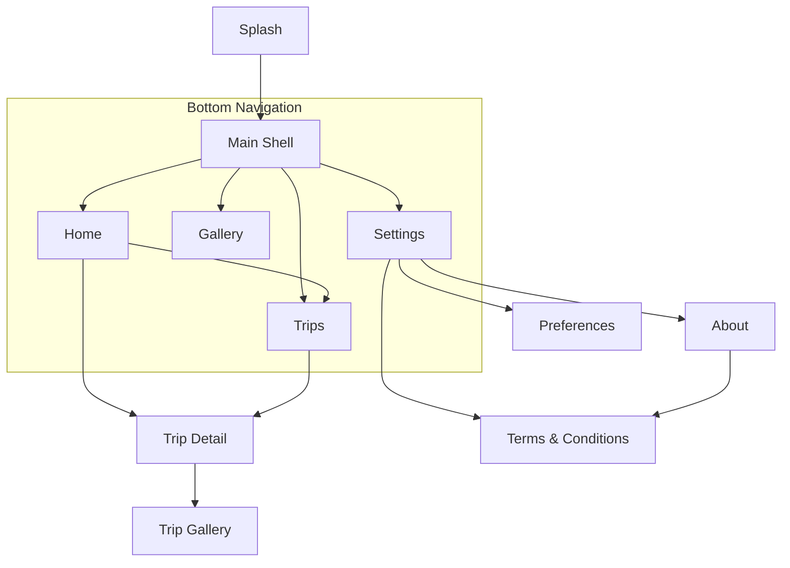
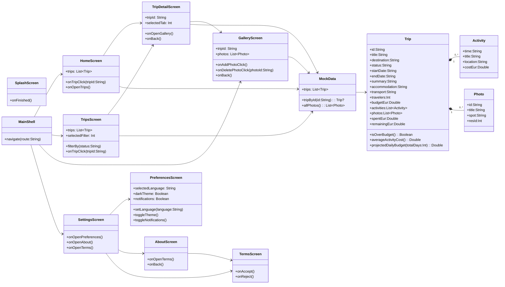

# Sprint 01 - Decisiones de diseño

## 1. Objetivo

Definir una base de app Travel Planner mock que sea:
- Clara en navegación
- Coherente visualmente
- Modular por capas
- Escalable para Sprint 02

---

## 2. Arquitectura

Estructura usada en el proyecto:

- `ui/`: pantallas y componentes Compose
- `navigation/`: rutas y grafos
- `data/`: datos mock hardcoded
- `domain/`: entidades y funciones de negocio

Esta separación permite evolucionar UI y datos sin acoplamiento fuerte.

---

## 3. Modelo de navegación

### Root graph

- `Splash`
- `Main`
- `TripDetail/{tripId}`
- `Gallery/{tripId}`
- `Terms`

### Bottom navigation (`MainShell`)

- `Home`
- `Trips`
- `Gallery`
- `Settings`

### Flujo de pantallas (Mermaid)



---

## 4. Diagrama UML de app (pantallas + acciones)

Este diagrama extiende el flujo anterior con atributos y funciones principales.



---

## 5. Modelo de dominio

Entidades principales:

- `Trip`: agregado principal del viaje
- `Activity`: item de itinerario con coste
- `Photo`: item de galería

Funciones de `Trip` en Sprint 01:

- `spentEur`
- `remainingEur`
- `isOverBudget()`
- `averageActivityCost()`
- `projectedDailyBudget(totalDays)`

El diagrama de dominio detallado se mantiene en `docs/domain-model.mmd`.

---

## 6. UI y tema

- Base visual Material 3
- Identidad morado/amarillo
- Tarjetas y jerarquía clara
- Preferencias con idioma mock: `English`, `Español`, `Català`

---

## 7. Actualización Sprint 02 (Logic)

Arquitectura implementada para el segundo sprint:

- `UI -> ViewModel -> Repository -> DataSource`
- `FakeTripDataSource` como almacenamiento in-memory
- `TripRepository` + `TripRepositoryImpl` para CRUD de viajes y actividades
- `SharedPreferencesSettingsRepository` para persistir ajustes de usuario

Se añadieron validaciones funcionales para:

- campos obligatorios
- fechas de viaje (inicio < fin y futuras)
- fechas de actividad dentro del rango del viaje

Además:

- Se aplicó soporte multiidioma real (`en`, `es`, `ca`) con recursos por locale
- Se añadieron logs de operaciones y errores de validación para Logcat
- Se incorporaron pruebas unitarias de CRUD y validaciones base

---

## 8. Actualización Sprint 03 (Room, Hilt y Firebase)

La arquitectura de producción queda como:

```text
Compose UI
  -> ViewModel
  -> Repository
  -> Room / Firebase / SharedPreferences
```

### Inyección de dependencias

Se usa Hilt como librería DI:

- `BBTravelingApplication` con `@HiltAndroidApp`.
- `AppModule` provee `TravelDatabase`, DAOs, `FirebaseAuth` y `Clock`.
- `RepositoryModule` enlaza interfaces de dominio con implementaciones Room/Firebase.

### Esquema Room

Base de datos: `bbtraveling.db`

Tablas:

- `users`
  - `login` como primary key.
  - `username` único.
  - `birthdate`, `address`, `country`, `phone`, `acceptsReceiveEmails`.
- `trips`
  - `id` como primary key.
  - `ownerLogin` referencia a `users.login`.
  - campos de viaje: título, descripción, ciudad, país, fechas, estado, presupuesto, etc.
- `itinerary_items`
  - `id` como primary key.
  - `tripId` referencia a `trips.id`.
  - campos de actividad: título, descripción, fecha, hora, categoría y coste.
- `access_logs`
  - `id` autogenerado.
  - `userId`, `eventType`, `occurredAt`.

Relaciones:

```text
users.login 1 --- N trips.ownerLogin
trips.id    1 --- N itinerary_items.tripId
```

### Estrategia de uso

- Al registrar un usuario, Firebase crea la cuenta y Room guarda el perfil local.
- El registro valida todos los campos obligatorios, confirmación de contraseña y edad mínima de 18 años.
- Al hacer login, solo se acepta el usuario si el email está verificado y existe perfil local.
- Los viajes nuevos guardan `ownerLogin` con el email del usuario autenticado.
- La pantalla de viajes observa solo `trips.ownerLogin = currentUser.login`.
- Los eventos login/logout se insertan en `access_logs`.

### Migración

Durante Sprint 03 se ha usado `fallbackToDestructiveMigration(false)` porque es un prototipo académico y no se requiere conservar bases antiguas de sprints previos. Para una entrega real, el siguiente paso sería declarar migraciones Room versionadas y exportar schema.

### Tests

La cobertura del Sprint 03 incluye unit tests JVM con Robolectric para:

- `ExampleUnitTest`: entorno básico.
- `TripTest`: cálculos de dominio.
- `TripRepositoryImplTest`: CRUD in-memory, validaciones y título duplicado.
- `TravelDatabaseTest`: Room Database, DAOs y relaciones.
- `RoomTripRepositoryTest`: CRUD persistente y filtrado por usuario autenticado.
- `RoomUserProfileRepositoryTest`: mapeo y observación de perfil local.
- `AuthViewModelTest`: login, registro, recover password, confirmación de password y edad mínima.
- `SettingsViewModelTest`: perfil autenticado, idioma, tema y preferencias sin cuenta.
- `TripsViewModelTest`: carga, creación y validaciones desde ViewModel.
- `MainDispatcherRule`: soporte para corrutinas en tests.
